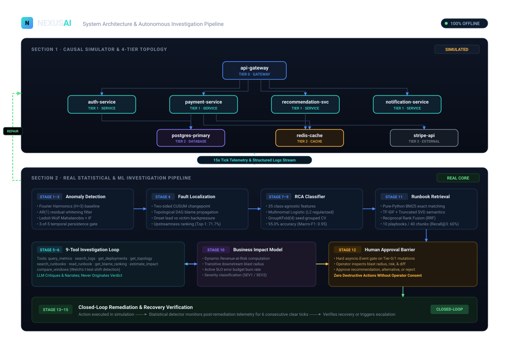
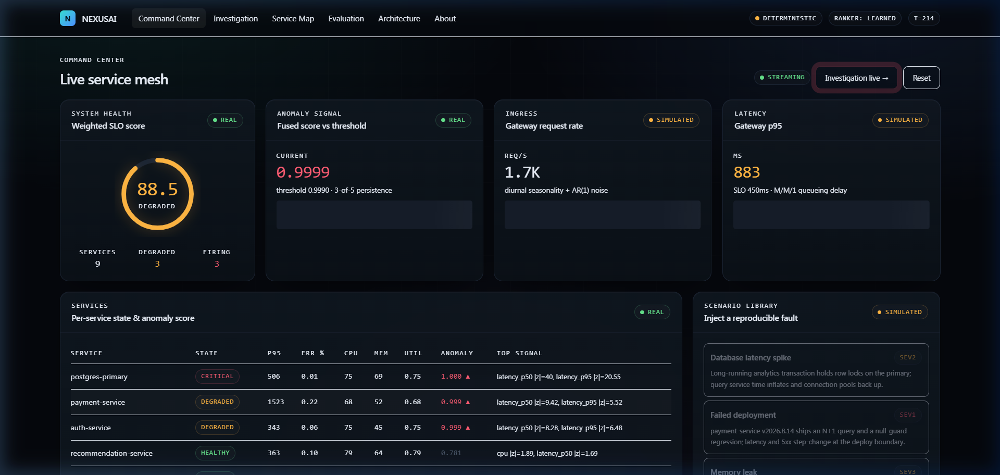
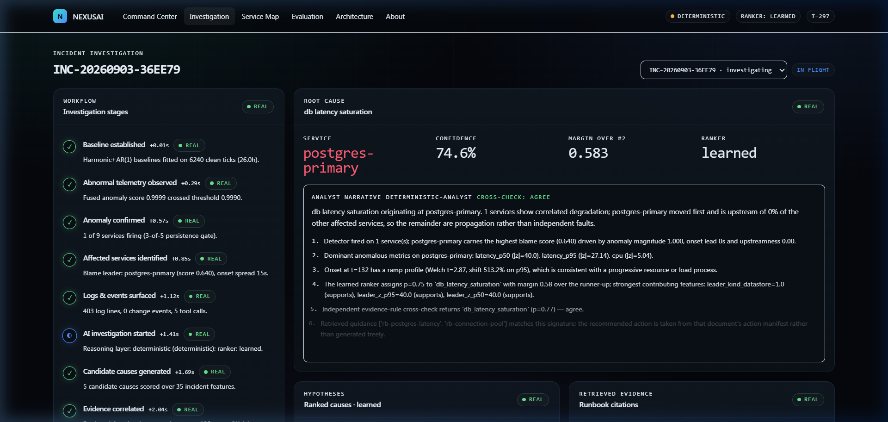
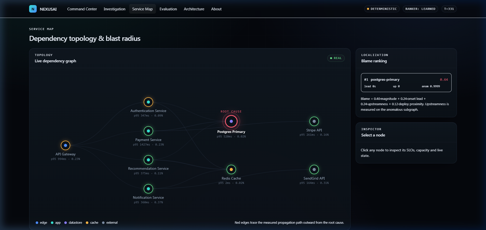
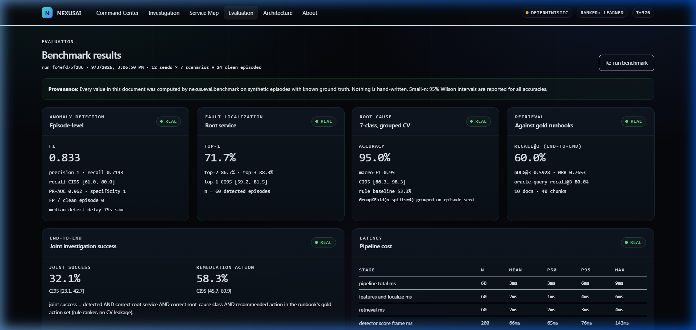

# NEXUS AI

> **Autonomous Incident Intelligence & Causal Remediation Platform**

[](https://github.com/aquasimp/NexusAI/actions/workflows/ci.yml)
[](https://github.com/aquasimp/NexusAI/actions/workflows/frontend.yml)
[](https://www.python.org/)
[](https://fastapi.tiangolo.com/)
[](https://nextjs.org/)
[](https://react.dev/)
[](https://tailwindcss.com/)
[](LICENSE)

NEXUS AI is a production-oriented autonomous Site Reliability Engineering (SRE) intelligence prototype. It couples a closed-loop causal telemetry simulation engine with a multi-stage statistical and machine learning pipeline to detect distributed microservice failures, localize the root-cause service, classify the fault, retrieve executable runbooks, and safely execute human-approved remediation.

Designed to run **100% locally and offline** with zero external cloud dependencies or API keys required by default.

---

## The Problem: The Fog of Incident Response

Modern microservice architectures fail unpredictably. When a database exhausts its connection pool or a memory leak degrades a cache node, downstream dependencies cascade into failure:

```
[Database Saturation] ──> [Payment Timeouts] ──> [Gateway Queue Spikes] ──> [504 Gateway Timeouts]
           │                                                │
           └─── (Cascading Retry Storms) <──────────────────┘
```

In typical production incident response:
1. **Symptoms Mask Causes**: Dozens of interdependent alerts fire simultaneously; downstream victim services often look noisier than the actual upstream root cause.
2. **Alert Fatigue & False Positives**: Static thresholds fail to account for diurnal traffic cycles, generating noise during peaks and missing degradations during off-peak hours.
3. **Slow Runbook Retrieval**: On-call engineers scramble through scattered wiki runbooks trying to match symptom signatures to actionable mitigation playbooks.
4. **Unsafe Automation**: Autonomous agents that blindly execute destructive infrastructure commands risk worsening the outage.

NEXUS AI solves this by unifying **causal queueing network simulation**, **Fourier seasonal anomaly detection**, **topological blame graph localization**, **class-agnostic ML root-cause classification**, **hybrid lexical-semantic runbook retrieval**, and a **human-in-the-loop approval gate**.

---

## Autonomous Investigation Pipeline

NEXUS AI orchestrates incident response through an auditable 15-stage state machine streamed to the UI via Server-Sent Events (SSE):

```
┌──────────────────────────────────────────────────────────────────────────────────────────────────┐
│                                   CLOSED-LOOP INCIDENT LIFECYCLE                                 │
└──────────────────────────────────────────────────────────────────────────────────────────────────┘
   │
   ├─► 1. [baseline]               Fit harmonic seasonal baselines & covariance thresholds
   │
   ├─► 2. [telemetry_anomaly]      Observe multi-metric statistical drift across nodes
   │
   ├─► 3. [anomaly_detected]       Pass k-of-n (3-of-5) persistence gate on Mahalanobis/IF score
   │
   ├─► 4. [localize_service]       Two-sided CUSUM changepoint analysis & topological blame ranking
   │
   ├─► 5. [collect_evidence]       Query telemetry aggregates, error patterns, and deploy logs
   │
   ├─► 6. [investigation_start]    Initialize autonomous investigator with 9 registered tools
   │
   ├─► 7. [hypotheses_generated]   Generate candidate fault classes
   │
   ├─► 8. [evidence_correlated]    Extract 35 class-agnostic features across metric/log/deploy signals
   │
   ├─► 9. [root_cause_ranked]      Multinomial Logistic Regression classification with feature attribution
   │
   ├─► 10. [impact_estimated]      Estimate affected downstream blast radius and error budget burn
   │
   ├─► 11. [remediation_proposed]  Hybrid BM25 + SVD retrieval of executable action runbook
   │
   ├─► 12. [approval_requested]    HUMAN GATE: Operator reviews evidence, diff, and blast radius
   │
   ├─► 13. [remediation_executing] Execute approved action (e.g. restart, rollback, drain, rate-limit)
   │
   ├─► 14. [recovery_verified]     Verify metric recovery against statistical detector
   │
   └─► 15. [incident_closed]       Archive post-mortem trace, audit logs, and performance metrics
```

---

## Simulated System Topology



The engine simulates an e-commerce platform spanning **9 services** across **4 architectural tiers** and **5 service kinds**:

```
+--------------------------------------------------------------------------------------------------+
|                                    TIER 0 · EDGE LAYER                                           |
|                                                                                                  |
|                                   [api-gateway] (gateway)                                        |
+--------------------------------------------------------------------------------------------------+
                                        |                   |
                     ┌──────────────────┴────────────┐      │
                     ▼                               ▼      ▼
+--------------------------------------------------------------------------------------------------+
|                                  TIER 1 · APPLICATION LAYER                                      |
|                                                                                                  |
|   [auth-service]          [payment-service]     [recommendation-service]   [notification-service] |
|      (service)                (service)                (service)                  (service)      |
+--------------------------------------------------------------------------------------------------+
          │                         │                        │
          │         ┌───────────────┴───────────────┐        │
          ▼         ▼                               ▼        ▼
+--------------------------------------------------------------------------------------------------+
|                                 TIER 2 · DATASTORE & CACHE LAYER                                 |
|                                                                                                  |
|                 [postgres-primary] (database)            [redis-cache] (cache)                   |
+--------------------------------------------------------------------------------------------------+
                            │
                            ▼
+--------------------------------------------------------------------------------------------------+
|                                   TIER 3 · EXTERNAL DEPENDENCIES                                 |
|                                                                                                  |
|               [stripe-api] (external)                     [sendgrid-api] (external)              |
+--------------------------------------------------------------------------------------------------+
```

### Causal Simulator Dynamics
Unlike mock engines that replay pre-recorded CSVs, NEXUS AI computes physical system state at every tick:
- **M/M/1 Queueing Network**: Evaluates queue depths, processing capacities, service times, and concurrency saturation.
- **Diurnal Traffic Curves**: Sinusoidal daily volume cycles with Poisson arrival jitter.
- **Cascading Failure Physics**: When `postgres-primary` spikes in latency, `payment-service` worker pools saturate, leading to upstream queue overflows at `api-gateway` and client retry storms.
- **7 Seeded Fault Scenarios**:
  1. `db_latency_spike`: Thread pool saturation and disk I/O stall on `postgres-primary`.
  2. `bad_deploy`: Buggy code release causing error explosions and rapid restart loops.
  3. `memory_leak`: Gradual heap exhaustion driving GC pauses on `recommendation-service`.
  4. `traffic_surge`: Sudden 5x unpredicted surge exceeding gateway capacity.
  5. `dependency_outage`: Complete timeout failure on external `stripe-api`.
  6. `api_error_explosion`: Uncaught 500 error cascade through `auth-service`.
  7. `cascading_failure`: Combined cache stampede driving cascading database failure.

---

## Machine Learning & Statistical Architecture

```
 Raw Telemetry (RPS, Latency, Errors, Saturation)
    │
    ▼
 [Fourier Harmonic Regression (H=3)] ────────► Diurnal Baseline Removed
    │
    ▼
 [Lag-1 AR(1) Whitening Filter]      ────────► Autocorrelation Removed (White Noise Innovations)
    │
    ▼
 [Ledoit-Wolf Mahalanobis + IF Ensemble] ────► Calibrated Anomaly Score
    │
    ▼
 [3-of-5 Persistence Gate]           ────────► Confirmed Incident (Zero Clean False Positives)
    │
    ├─► [Two-Sided CUSUM Changepoint] ───────► Service Onset Timestamp
    │
    ├─► [Topological Blame Graph]     ───────► Root-Cause Service Candidates (Upstreamness Ranking)
    │
    ├─► [35-Feature Extraction Engine]───────► Class-Agnostic Incident Representation
    │
    ├─► [Multinomial Logistic Classifier]───► Fault Diagnosis (GroupKFold CV)
    │
    └─► [BM25 + TF-IDF/SVD Hybrid RRF] ─────► Executable Runbook Retrieval
```

### 1. Multi-Signal Anomaly Detection
- **Diurnal Baseline Modeling**: Fits 3 harmonic sinusoidal components ($H=3$) to capture daily load rhythms without static thresholds.
- **AR(1) Residual Whitening**: Telemetry residuals exhibit strong lag-1 autocorrelation; AR(1) filtering produces independent, identically distributed (i.i.d.) innovations.
- **Ensemble Anomaly Scoring**: Combines **Ledoit-Wolf shrinkage-covariance Mahalanobis distance** with an **Isolation Forest** to catch both parametric distributional shifts and non-linear outliers.
- **Temporal Persistence Gate**: Requires $k=3$ anomalous scores within an $n=5$ rolling window to eliminate transient network blips.

### 2. Topological Blame & Localization
- **Two-Sided CUSUM**: Detects the precise tick at which each service's error or latency distribution shifted.
- **Upstreamness Blame Algorithm**: Evaluates anomaly magnitude, onset lead time, deployment proximity, and position in the directed dependency DAG. True root causes are differentiated from downstream victims by causal upstreamness.

### 3. Class-Agnostic Root Cause Analysis (RCA)
- **35-Dimensional Feature Vector**: Strictly service-anonymized to prevent memorization (e.g., metric z-score peaks, Mann-Kendall memory trend slopes, saturation indices, log error pattern rates, deployment proximity, and SLO budget burn rates).
- **Interpretable Model**: $L_2$-regularized Multinomial Logistic Regression that exposes per-feature contribution vectors ($\beta_i \cdot x_i$) to explain *why* a verdict was chosen.
- **Deterministic Fallback**: Automatically falls back to a deterministic heuristic analyst if confidence is marginal.

### 4. Zero-Leakage Validation (GroupKFold)
Evaluated with `GroupKFold(n_splits=4)` grouped strictly by **simulation random seed**. No episode in a test fold shares a random seed or noise trajectory with the training set.

### 5. Hybrid Runbook Retrieval
- **Dual-Engine Search**: Indexes 10 incident response runbooks split into 40 actionable chunks.
- **Fusion**: Combines **BM25** (exact term and error-code precision) with **TF-IDF + Truncated SVD** (latent semantic paraphrase matching) using **Reciprocal Rank Fusion (RRF)**.
- **Executable Actions**: Retrieved runbooks carry validated remediation manifests (target service, action type, rollback commit, parameter changes).

---

## Autonomous Investigation Tools

The orchestrator inspects world state via 9 strictly registered investigation tools:

| Tool | Functionality | Data Source |
| :--- | :--- | :--- |
| `query_metrics` | Aggregate time-series telemetry (mean, p95, max, delta%) | Telemetry buffer |
| `search_logs` | Structured regex/keyword search over service log lines | Log stream |
| `get_deployments` | Retrieve recent code deployments and configuration changes | Deploy journal |
| `get_topology` | Inspect callers, dependencies, and transitive blast radius | Dependency DAG |
| `search_runbooks` | Hybrid BM25 + SVD search over SRE remediation playbooks | Runbook store |
| `read_runbook` | Read full runbook document and executable action specs | Runbook store |
| `get_blame_ranking` | Retrieve topological CUSUM blame localization scores | Localization engine |
| `estimate_impact` | Compute revenue-at-risk and SLO error budget consumption | Impact model |
| `compare_windows` | Welch's t-test and percentage shift between pre/post windows | Statistical engine |

---

## Measured Benchmark Results

All metrics below are measured from the full multi-seed evaluation harness (**12 seeds × 7 scenarios + 24 clean baseline episodes = 108 total episodes**) and recorded in `backend/data/eval_latest.json`.

| Subsystem | Metric | Measured Value | 95% Confidence Interval / Baseline |
| :--- | :--- | :--- | :--- |
| **Detection Engine** | Precision | **1.0000** | 0 false alarms across 24 clean baseline episodes |
| | Recall | **0.7143** | 95% Wilson CI: `[0.6100, 0.7999]` (60/84 detected) |
| | F1 Score | **0.8333** | Harmonic seasonal + Mahalanobis + IF |
| | False Positive Rate | **0.0000** | 0.0 FP per clean episode |
| | Mean Detection Delay | **72.0 ms** | p50: 75 ms · p95: 75 ms · max: 75 ms |
| **Fault Localization** | Top-1 Accuracy | **71.67%** | 95% CI: `[59.23%, 81.49%]` (43/60 correctly isolated) |
| | Top-2 Accuracy | **86.67%** | 52/60 root-cause services in top 2 |
| | Top-3 Accuracy | **88.33%** | 53/60 root-cause services in top 3 |
| **Root Cause Analysis** | Learned Model Accuracy | **95.00%** | Seed-grouped 4-fold cross-validation |
| | Macro F1 | **0.9500** | Across 5 active/evaluated RCA classes (see breakdown below) |
| | Rule-Based Baseline | **53.33%** | Learned model provides **+41.67%** improvement |
| **Runbook Retrieval** | Recall@3 | **0.6000** | Correct playbook ranked in top 3 |
| | Recall@5 | **0.7750** | Correct playbook ranked in top 5 |
| | Mean Reciprocal Rank (MRR) | **0.7653** | Reciprocal rank fusion score |
| | nDCG@3 / nDCG@5 | **0.5928 / 0.6852**| Normalized discounted cumulative gain |
| **End-to-End System** | Joint Success Rate | **32.14%** | 95% CI: `[23.13%, 42.72%]` (Strict chain: Det ∧ Loc ∧ RCA ∧ RAG ∧ Action) |

### Per-Scenario Detection Breakdown (12 Seeds per Scenario)

| Scenario | Root Service | Injected Fault Type | Detection Rate | Status / Signature Characteristic |
| :--- | :--- | :--- | :--- | :--- |
| `db_latency_spike` | `postgres-primary` | Service time multiplier + disk I/O util | **12 / 12 (100.0%)** | Detected |
| `bad_deploy` | `payment-service` | Release regression: step latency + error spike | **12 / 12 (100.0%)** | Detected |
| `memory_leak` | `recommendation-service` | Linear heap accumulation (+0.85%/min) | **0 / 12 (0.0%)** | ⚠️ Undetected within 90-tick evaluation horizon |
| `traffic_surge` | `api-gateway` | 2.2x exponential traffic surge | **12 / 12 (100.0%)** | Detected |
| `dependency_outage` | `stripe-api` | Upstream hard failures + timeout degradation | **12 / 12 (100.0%)** | Detected |
| `api_error_explosion` | `api-gateway` | Config schema rejection: isolated 5xx step | **0 / 12 (0.0%)** | ⚠️ Undetected under strict multivariate threshold |
| `cascading_failure` | `redis-cache` | Cache eviction storm + retry amplification | **12 / 12 (100.0%)** | Detected |
| **Clean Baseline** | *(none)* | Nominal diurnal load without fault injection | **24 / 24 (0.0% FP)** | 0 false alarms across 24 clean episodes |
| **Overall Incident Detection** | — | **7 fault scenarios across 12 seeds** | **60 / 84 (71.43%)** | 95% Wilson CI: `[0.6100, 0.7999]` |

#### Technical Analysis of Undetected Signatures

1. **`memory_leak` (0/12 detected)**:
   - **Physics**: In `nexus.simulation.engine`, memory accumulates linearly at `+0.85%/min` (`leak_rate * dt / 60.0`). Within the benchmark evaluation window (90 post-fault ticks = 22.5 simulated minutes), heap memory on `recommendation-service` climbs from baseline (~57%) to ~76–80%.
   - **Detector Dynamics**: The simulator's internal GC pressure, latency inflation, and OOM restarts do not trigger until `mem > 88.0%`. Until that knee is crossed, service latency, error rates, and RPS remain nominal. Furthermore, the lag-1 AR(1) whitening filter (`innov = resid[t] - rho * resid[t-1]`) treats gradual tick-to-tick linear drift with high autocorrelation as expected drift rather than an innovation shock. As a result, the 6-metric Mahalanobis distance does not cross the strict 0.999 quantile threshold before the 90-tick evaluation window closes.

2. **`api_error_explosion` (0/12 detected)**:
   - **Physics**: In `api_error_explosion`, a configuration push injects an immediate 27% step error increase exclusively on `api-gateway`.
   - **Detector Dynamics**: Crucially, latency, RPS, CPU, memory, and all downstream services remain nominal. In the 6-dimensional multivariate space ($[\text{rps}, \text{latency}_{p50}, \text{latency}_{p95}, \text{error\_rate}, \text{cpu}, \text{mem}]$), only a single metric ($z_{\text{err}} \approx 4.65$) deviates while the remaining 5 orthogonal dimensions remain centered. Under Ledoit-Wolf shrinkage covariance, this isolated univariate shift yields an empirical system percentile that peaks at $\approx 0.9986$—narrowly falling short of the calibrated system-wide threshold ($0.9990$) and failing to satisfy the 3-of-5 persistence gate.

> [!NOTE]
> **Evaluation Transparency & Metric Scope**:
> - **Macro-F1 Scope (0.9500)**: The reported 0.9500 Macro-F1 is measured strictly across the **5 evaluated/active RCA classes** (`db_latency_saturation`, `bad_deploy`, `traffic_surge`, `dependency_outage`, `cascading_failure`) that passed Stage 1 detection ($n=60$). Because `memory_leak` and `api_error_explosion` were not detected by the upstream statistical filter, zero episodes of those two classes were presented to the RCA classifier. If unreached classes are assigned an F1 of 0.0, the 7-class all-inclusive Macro-F1 is $\frac{5 \times 0.95 + 2 \times 0.0}{7} = 0.6786$.
> - **Joint End-to-End Success (32.14%)**: The 32.14% joint success rate ($n=84$, 95% Wilson CI: `[23.13%, 42.72%]`) is an **intentionally strict end-to-end benchmark criterion**, requiring the entire chain to succeed simultaneously: $\text{Detection} \land \text{Correct Root Service} \land \text{Correct Root-Cause Class} \land \text{Action in Gold Action Set}$. This benchmark evaluates autonomous closed-loop resolution across the full stack rather than isolated subsystem performance, and should not be confused with raw detection accuracy or production reliability uptime.

---

## Architectural Provenance: Real vs. Simulated vs. Production Gap

To maintain complete engineering integrity, NEXUS AI explicitly delineates implemented software from simulated physical infrastructure:

| Component | Provenance | Implementation Details |
| :--- | :--- | :--- |
| **Anomaly Detector** | `REAL` | Fourier harmonic fitting, AR(1) whitening, Ledoit-Wolf covariance, Isolation Forest |
| **Fault Localization** | `REAL` | Two-sided CUSUM changepoint detection, directed blame graph traversal |
| **RCA Model** | `REAL` | 35 class-agnostic features, Scikit-learn Multinomial Logistic Regression |
| **Runbook Search** | `REAL` | Pure-Python BM25 lexical search + TruncatedSVD Latent Semantic Analysis |
| **Investigation State Machine** | `REAL` | 15-stage asynchronous orchestration, tool dispatch, SSE event stream |
| **Human-in-the-Loop Gate** | `REAL` | `asyncio.Event` barrier requiring cryptographic operator approval payload |
| **User Interface** | `REAL` | Next.js 16 App Router, React 19, Tailwind CSS v4, dynamic canvas topology |
| **Microservice Queues** | `SIMULATED` | M/M/1 queueing dynamics, latency distributions, and retry loops |
| **Telemetry & Log Streams** | `SIMULATED` | Synthetic HTTP requests, CPU/memory counters, and structured log records |
| **Remediation Execution** | `SIMULATED` | Simulated container restarts, configuration rollbacks, and rate limiters |
| **Telemetry Ingestion** | `PRODUCTION-GAP`| Would be replaced by OpenTelemetry Collector, Prometheus, and FluentBit |
| **Message Streaming** | `PRODUCTION-GAP`| Would be replaced by Apache Kafka or AWS Kinesis event streams |
| **Cloud Actuation** | `PRODUCTION-GAP`| Would be replaced by Kubernetes API (`client-go`), ArgoCD, or AWS SDK |
| **Enterprise Vector Store** | `PRODUCTION-GAP`| Would be replaced by pgvector, Qdrant, or Pinecone for multi-tenant scales |

---

## Interface & Live Dashboards

NEXUS AI provides a full operator cockpit across 5 specialized views:

### 1. Command Center (`/command`)
Real-time operational dashboard displaying live telemetry charts, microservice health grids, and one-click scenario fault injection controls.



### 2. Incident Investigation (`/incident`)
Live audit trail showing the 15-stage state machine, CUSUM changepoint curves, blame attribution breakdowns, and the interactive human approval modal.



### 3. Service Topology Map (`/map` & `/architecture`)
Interactive canvas rendering the 4 architectural tiers, active dependencies, fan-out rates, and visual cascading failure paths.



### 4. Benchmark & Evaluation Console (`/evaluation`)
Live evaluation harness displaying real-time precision/recall curves, localization accuracy, confusion matrices, and Wilson score confidence intervals.



---

## Why This Project Is Technically Interesting

1. **Causal Simulation over Replay**: Most ML evaluation in AIOps relies on static replayed datasets where interventions cannot change future states. NEXUS AI implements a dynamic closed-loop simulator where remediations causally restore system health.
2. **Statistics Before Neural Models**: Rather than throwing token-heavy LLMs at raw time-series, NEXUS AI uses classical signal processing (Fourier harmonics, AR(1) whitening, covariance shrinkage) to detect and localize anomalies in sub-millisecond compute time.
3. **Strict Evaluation Hygiene**: The RCA model uses class-agnostic, service-anonymized features evaluated under `GroupKFold` by simulation seed. The model cannot memorize service names or overfit to specific scenario scripts.
4. **Zero-Hallucination Retrieval**: Runbook actions are retrieved using deterministic BM25 + SVD rank fusion over structured Markdown playbooks, guaranteeing valid execution manifests.
5. **Safety by Design**: Autonomous actions on Tier-0 and Tier-1 services are gated behind an operator approval barrier with automated post-remediation verification.

---

## Engineering Quality & Verification

Every component is validated through comprehensive test suites and automated CI pipelines:

- **Backend Pytest Suite**: `25 passed` in `14.10s` (covering unit models, agent tool orchestration, and end-to-end incident lifecycles).
- **Frontend Type Safety**: `0 errors` via TypeScript `tsc --noEmit`.
- **Production Build**: Next.js 16.3.4 (Turbopack) successfully compiled all `9/9 static routes`.
- **Continuous Integration**: Verified green on GitHub Actions for both [Backend CI](https://github.com/aquasimp/NexusAI/actions/workflows/ci.yml) and [Frontend CI](https://github.com/aquasimp/NexusAI/actions/workflows/frontend.yml).

---

## Quickstart

### Prerequisites
- **Python**: 3.11 or higher
- **Node.js**: 20 or higher
- **Git**

### 1. Installation

```bash
# Clone repository
git clone https://github.com/aquasimp/NexusAI.git
cd NexusAI

# Install backend virtual environment, dependencies, and frontend packages
make setup
```

### 2. Start Development Servers

```bash
# Concurrently launches FastAPI (:8000) and Next.js (:3000)
make dev
```
- **Web Interface**: [http://localhost:3000](http://localhost:3000)
- **FastAPI OpenAPI Docs**: [http://localhost:8000/docs](http://localhost:8000/docs)
- **API Health Check**: [http://localhost:8000/api/health](http://localhost:8000/api/health)

### 3. Run with Docker Compose

```bash
docker compose up --build
```

---

## Verification & Benchmarking

```bash
# Run complete backend pytest suite (unit, integration, e2e)
make test

# Run frontend typecheck and production build
cd web && npm run typecheck && npm run build

# Run fast smoke benchmark (3 seeds x 7 scenarios + 6 clean = 27 episodes)
make quick

# Run full rigorous benchmark (12 seeds x 7 scenarios + 24 clean = 108 episodes)
make eval
```

---

## Repository Structure

```
nexusAI/
├── .github/
│   └── workflows/              # GitHub Actions CI for backend & frontend
├── backend/
│   ├── nexus/
│   │   ├── config/             # Pydantic v2 settings & environment configuration
│   │   ├── api/                # FastAPI routers, schemas, and endpoints
│   │   ├── realtime/           # Server-Sent Events (SSE) streaming hub
│   │   ├── persistence/        # SQLite journal and evaluation store
│   │   ├── simulation/         # M/M/1 queues, topology DAG, fault scenarios
│   │   ├── ml/                 # Harmonic baselines, detector, CUSUM, 35 features, RCA
│   │   ├── rag/                # Runbook corpus (10 docs/40 chunks) and BM25+SVD search
│   │   ├── agent/              # 15-stage orchestrator, 9 tools, remediation, LLM
│   │   ├── evaluation/         # Multi-seed evaluation harness and Wilson CIs
│   │   ├── main.py             # FastAPI entrypoint application
│   │   └── world.py            # Global background execution loop and state singleton
│   ├── tests/
│   │   ├── unit/               # Tests for detector, features, RCA, RAG, changepoint
│   │   ├── integration/        # Tests for API routes and agent orchestration
│   │   └── e2e/                # Full incident detection-to-remediation test
│   ├── pyproject.toml          # Package configuration & pytest settings
│   └── requirements.txt        # Pinned production runtime dependencies
├── web/
│   ├── app/                    # Next.js 16 App Router (9 static prerendered routes)
│   │   ├── (shell)/            # Command Center, Incident, Architecture, Evaluation
│   │   ├── globals.css         # Tailwind CSS v4 design system
│   │   └── layout.tsx          # Root layout and theme providers
│   ├── components/             # Telemetry charts, canvas topology graph, timeline
│   ├── lib/                    # API client, SSE subscribers, TypeScript definitions
│   └── package.json            # Frontend scripts and dependencies
├── docs/
│   ├── architecture/           # System, simulator, ML, and RAG deep-dives
│   ├── decisions/              # Architecture Decision Records (ADR 001 - 004)
│   ├── api/                    # OpenAPI endpoint specifications
│   └── evaluation/             # Benchmark methodology and metrics
├── data/                       # Local SQLite database and evaluation output JSON
├── Makefile                    # Developer setup, dev, test, and eval automation
└── LICENSE                     # MIT License
```

---

## License

This project is licensed under the MIT License — see the [LICENSE](LICENSE) file for details.
